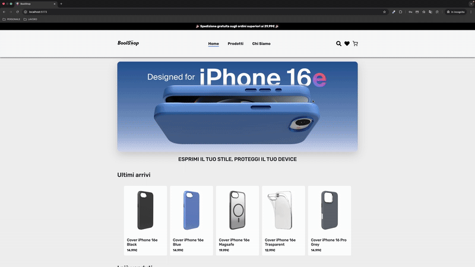

# BoolShop

BoolShop è un'applicazione full-stack progettata per gestire un negozio online. Il progetto include un back-end basato su Node.js con Express e un front-end sviluppato con React e Vite. L'applicazione consente agli utenti di cercare prodotti, effettuare ordini, gestire pagamenti e ricevere conferme via email.

## Struttura del Progetto

La struttura del progetto è organizzata in due principali directory:

- **back-end/**: Contiene il server Node.js, le API e la logica di gestione dei dati.
- **front-end/**: Contiene l'applicazione React per l'interfaccia utente.

### Back-End

Il back-end è costruito con Node.js e utilizza Express per gestire le API. Di seguito sono riportati i principali file e funzionalità:

#### `app.js`

- Configura il server Express.
- Utilizza middleware come `cors` per abilitare richieste cross-origin e `express.json` per il parsing del corpo delle richieste.
- Definisce il router principale per la gestione delle rotte relative ai prodotti (`/cover`).

#### `routers/coverRouter.js`

- Gestisce le rotte relative ai prodotti e agli ordini.
- Rotte principali:
  - `GET /cover/`: Restituisce tutti i prodotti.
  - `GET /cover/search`: Permette di cercare prodotti tramite query string.
  - `GET /cover/:slug`: Restituisce i dettagli di un prodotto specifico.
  - `POST /cover/order`: Consente di creare un nuovo ordine.
  - `POST /cover/payment`: Gestisce i pagamenti tramite Stripe.
  - `POST /cover/register`: Invia coupon agli utenti.

#### `controllers/`

- **`coverControllers.js`**:
  - `index`: Restituisce tutti i prodotti dal database.
  - `show`: Restituisce i dettagli di un prodotto specifico basato sullo slug.
  - `search`: Permette di cercare prodotti per nome o descrizione, con opzioni di ordinamento.
- **`orderController.js`**:
  - Gestisce la creazione degli ordini e invia email di conferma agli utenti utilizzando Mailtrap.
- **`paymentContoller.js`**:
  - Gestisce i pagamenti tramite Stripe, creando intenti di pagamento e restituendo il client secret.
- **`searchControllers.js`**:
  - Implementa una ricerca avanzata con filtri e ordinamenti.
- **`coupons.js`**:
  - Invia coupon agli utenti (non dettagliato nel contesto attuale).

#### `data/db-cover.js`

- Configura la connessione al database MySQL utilizzando le credenziali definite in variabili d'ambiente.

#### `middlewares/imagePath.js`

- Aggiunge un prefisso al percorso delle immagini per restituire URL completi.

### Front-End

Il front-end è sviluppato con React e utilizza Vite per il bundling e lo sviluppo rapido. Di seguito sono riportati i principali file e funzionalità:

#### `src/`

- **`App.jsx`**: Punto di ingresso principale dell'applicazione React.
- **`components/`**: Contiene i componenti riutilizzabili dell'interfaccia utente.
- **`pages/`**: Contiene le pagine principali dell'applicazione.
- **`layouts/`**: Gestisce i layout globali.
- **`context/`**: Implementa il contesto globale per la gestione dello stato.
- **`assets/`**: Contiene immagini e altri file statici.
- **`style/`**: Contiene i file CSS per la personalizzazione dello stile.

#### `vite.config.js`

- Configura Vite per il progetto, inclusi plugin come `@vitejs/plugin-react`.

#### `eslint.config.js`

- Configura le regole di linting per mantenere uno stile di codice coerente.

## Funzionalità Principali

### 1. Gestione Prodotti

- Gli utenti possono visualizzare tutti i prodotti disponibili.
- È possibile cercare prodotti per nome o descrizione e ordinarli per prezzo, nome o data di creazione.

### 2. Creazione Ordini

- Gli utenti possono effettuare ordini fornendo i dettagli richiesti.
- Gli ordini vengono salvati nel database e viene inviata un'email di conferma.

### 3. Pagamenti

- I pagamenti vengono gestiti tramite Stripe.
- L'API crea un intent di pagamento e restituisce un client secret per completare la transazione.

### 4. Invio Email

- Utilizza Mailtrap per inviare email di conferma ordine con un riepilogo dettagliato.

## Configurazione

### Back-End

1. Clona il repository.
2. Installa le dipendenze:
   ```sh
   npm install
